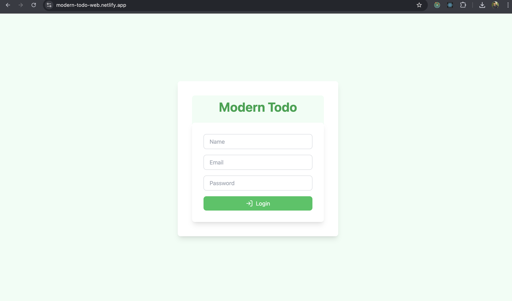
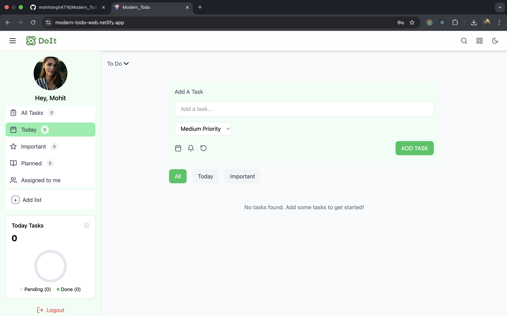
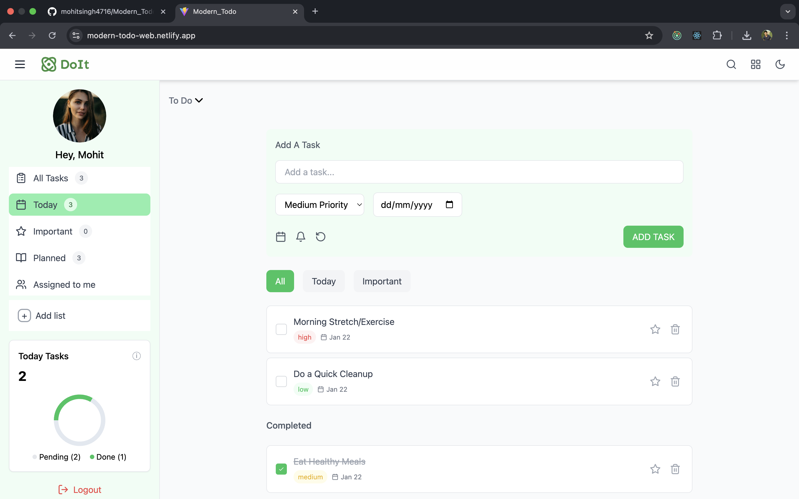

# Modern Todo
 

This project is an advanced **Modern_Todo**, application designed to enhance user experience with features like  advanced state management using Redux, and a responsive design to ensure usability across all device sizes. The application allows users to manage tasks efficiently while offering additional functionalities such as task prioritization and user authentication.

## Getting Started

To set up and run the Modern_Todo development server:
### Installation
1. Clone the repo
   ```sh
   git clone https://github.com/mohitsingh4716/Modern_Todo.git
   ```
2. Install NPM packages
   ```sh
   npm install
    ```
3. Start the development server:
   ```sh
   npm run dev 
    ```

 Start the development server.
 Open [ http://localhost:5173/]( http://localhost:5173/) in your browser to access the application.


## Features

- **Adding Tasks:**: Enter a task in the input field and click the "Add Task" button or press Enter.
- **Viewing Tasks:**: All tasks are displayed in a list format with their priorities.
- **Deleting Tasks**: Click the delete button next to a task to remove it from the list.
- **User Authentication**: Login to access the To-Do list and manage tasks securely.

## Learn More

For more details on the technologies used:

- * Frontend : React, Redux, HTML, CSS

- * State Management: Redux Thunk/Saga

- * Styling: Tailwind CSS

- * Authentication: using Redux state

## Deployment

Modern_Todo is deployed on the [Netlify Platform](https://app.netlify.com//), which provides seamless deployment and scaling for  applications. You can view the live site [here](https://modern-todo-web.netlify.app/).

## Screenshots
[](https://example.com)
[](https://example.com)
[](https://example.com)